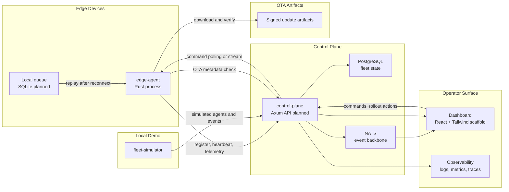

# EdgeFleet Architecture

This document describes the intended EdgeFleet system architecture and the
boundaries future implementation should preserve. It is phase-aware: some pieces
exist today as Rust scaffolds, while others are planned milestones in
[PLAN.md](../PLAN.md).

EdgeFleet is not a generic cloud-scale ingestion platform. The architecture is
optimized for a self-hostable fleet operations workflow: devices register,
report telemetry, survive connectivity loss, replay buffered data, receive
commands, and participate in signed OTA rollouts.

## Current State

The repository currently contains a Rust workspace with these crates:

| Crate | Current role |
| --- | --- |
| `edgefleet-types` | Shared telemetry, registration, heartbeat, command, and OTA wire models. |
| `edge-agent` | Edge agent that registers with the control plane over HTTP and persists its device identity; builds heartbeat and telemetry payloads ahead of the transport slice. |
| `control-plane` | Axum HTTP service with health probes and an idempotent device registration endpoint backed by an in-memory device registry. |
| `fleet-simulator` | Simulator scaffold that generates sample telemetry for local devices. |

The control plane now serves a real HTTP listener with health probes and device
registration; the edge agent registers against it and persists/reuses its
identity. PostgreSQL persistence, NATS integration, telemetry and heartbeat
transport, and live dashboard data remain planned work. Architecture changes
should keep the contracts and crate boundaries ready for them without pretending
the runtime stack is already complete.

## System Overview



Early phases can use direct HTTP and database flows. NATS is the planned event
backbone for telemetry fanout, device state changes, and command delivery, so
new APIs should avoid designs that would block later event publication.

## Component Boundaries

### Edge Agent

The edge agent is the device-side process. It owns device identity, telemetry
collection, local durability during outages, reconnect behavior, command
handling, and OTA verification.

The agent should:

- Treat offline behavior as a core feature.
- Persist outbound telemetry before acknowledging local collection.
- Reconnect with backoff and jitter.
- Replay queued events idempotently.
- Handle duplicate command delivery without unsafe repeated side effects.
- Verify signed update artifacts before applying OTA changes.

### Control Plane

The control plane is the central API and orchestration service. It owns device
registration, fleet inventory, telemetry ingestion, heartbeat status, command
tracking, rollout orchestration, and operator-facing health endpoints.

The control plane should:

- Expose typed request and response models from `edgefleet-types`.
- Store device, heartbeat, telemetry, command, and rollout state durably.
- Deduplicate telemetry by `event_id`.
- Keep command acknowledgement state explicit.
- Publish events to NATS when the messaging layer is introduced.
- Expose health, readiness, metrics, and tracing endpoints as operations mature.

### Shared Types

`edgefleet-types` is the wire-contract crate. It should remain focused on data
models and validation that are shared by the agent, control plane, simulator,
tests, and future dashboard API clients.

Shared contracts should:

- Keep operational fields typed.
- Put device-specific readings in `serde_json::Value`.
- Preserve stable field names for API and event payloads.
- Include validation for required identifiers and schema versions.
- Avoid runtime dependencies that belong to a specific service.

### Fleet Simulator

The simulator is a local demo and test tool. It should make it easy to exercise
fleet behavior without requiring physical devices.

Over time it should support:

- Configurable fleet size.
- Stable and random device identities.
- Telemetry bursts.
- Disconnect and reconnect scenarios.
- Queue and replay demonstrations.
- Command and OTA rollout simulations.

### Dashboard

The dashboard is an operator tool, not a marketing surface. The Phase 0
scaffold uses React, TypeScript, Tailwind, Vite, and static mock fleet data to
reserve the operator surface before live APIs exist. It should continue to
optimize for dense, readable fleet state and workflows an operator would
naturally need: device inventory, stale-device status, live telemetry, queue
depth, command history, rollout progress, and observability links.

## Core Data Flows

### Device Registration

1. Agent starts with local configuration or generated identity material.
2. Agent sends a registration request to the control plane.
3. Control plane accepts or rejects the device and returns credentials or
   registration state.
4. Agent persists identity and authentication material locally.

Registration should be explicit enough to support real devices and simulated
devices without separate contract paths.

### Heartbeats

1. Agent periodically reports device status, version, queue depth, and time.
2. Control plane records the latest heartbeat.
3. Dashboard derives online, degraded, offline, or stale status from heartbeat
   freshness and reported state.

Heartbeat writes should be cheap, frequent, and safe to retry.

### Telemetry Ingestion

Telemetry events use a stable envelope:

```json
{
  "device_id": "edge-042",
  "event_id": "01JZ9X6N9VD4Y7Y3P2Z5F8K4QG",
  "timestamp": "2026-06-18T19:42:10Z",
  "type": "sensor.reading",
  "schema_version": 1,
  "payload": {
    "temperature_c": 41.2,
    "humidity": 0.61,
    "fan_rpm": 2380
  }
}
```

The control plane should treat `event_id` as the idempotency key for retries,
offline replay, and reconnect storms. Device-specific values belong in
`payload`; routing, validation, deduplication, and dashboard display should rely
on the typed envelope fields.

### Offline Buffering And Replay

1. Agent persists telemetry locally before delivery.
2. If the control plane is unavailable, events remain queued.
3. Agent reconnects with backoff and jitter.
4. Agent replays buffered telemetry in a deterministic order.
5. Control plane deduplicates already-seen `event_id` values.
6. Agent marks events delivered only after successful acknowledgement.

This flow is one of the central product differentiators. It should be designed
before optimizing for throughput.

### Commands

1. Operator or API client issues a command for a device.
2. Control plane records the command and delivery state.
3. Agent receives the command through polling, streaming, or a later messaging
   path.
4. Agent acknowledges accepted, running, succeeded, failed, or rejected status.
5. Dashboard shows command history and current state.

Commands should be idempotent where possible, and command acknowledgements
should tolerate duplicate delivery.

### OTA Rollouts

1. Operator creates a rollout for a target group and signed artifact.
2. Control plane exposes OTA metadata to eligible agents.
3. Agent downloads the artifact, verifies hash and signature, and applies it.
4. Agent reports rollout status.
5. Control plane supports canary progression, pause, cancel, failure, and
   rollback states.

Signing keys, artifact publishing, and rollback behavior should be documented
when the OTA implementation begins.

## Reliability Rules

- Every telemetry event needs a stable `event_id`.
- Agent-side persistence should happen before network delivery is considered
  complete.
- Retries and replay must assume duplicate submissions are possible.
- Control plane writes should be idempotent at API boundaries where practical.
- Commands and OTA actions should expose state transitions rather than hidden
  one-shot side effects.
- Health, readiness, metrics, logs, and traces should be added around service,
  queue, persistence, command, and OTA boundaries as those features land.

## Phase Boundaries

| Phase | Architecture focus |
| --- | --- |
| Phase 0 | Workspace shape, shared contracts, development workflow, dashboard and local stack scaffolds. |
| Phase 1 | Registration, heartbeat, telemetry ingestion, persistence, dashboard inventory, simulator demo. |
| Phase 2 | Agent queue, reconnect, replay, idempotent ingestion, failure simulation. |
| Phase 3 | NATS backbone, command workflow, metrics, tracing, health, readiness. |
| Phase 4 | Signed OTA artifact verification, rollout orchestration, canary and rollback state. |
| Phase 5+ | Demo hardening, operational runbook, architecture diagrams, deployment and release polish. |

Do not pull later-phase capabilities into the critical path unless they are
explicitly requested. A narrow working vertical slice is more valuable than a
large amount of unused infrastructure.

## Non-Goals

- Replacing AWS IoT or other managed IoT platforms feature for feature.
- Optimizing for multi-region cloud scale before the local fleet workflow works.
- Building advanced edge compute features before registration, telemetry,
  offline replay, commands, and OTA are demonstrable.
- Adding service abstractions that do not support the current or next planned
  phase.

## Documentation Map

- [README.md](../README.md): project overview, current status, and local
  development guide.
- [PLAN.md](../PLAN.md): roadmap, phase boundaries, validation criteria, and
  release sequence.
- [CONTRIBUTING.md](../CONTRIBUTING.md): contribution workflow, local checks, and
  documentation expectations.
- [EdgeFleet.md](../EdgeFleet.md): product positioning and original design
  notes.
